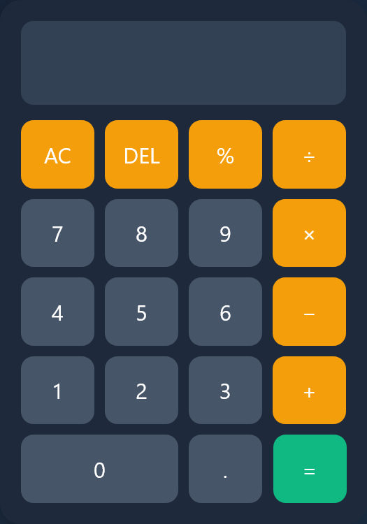

# Basic Calculator

A simple and responsive calculator built with HTML, CSS, and JavaScript. This project performs basic arithmetic operations through an intuitive user interface and demonstrates fundamental front-end development concepts.

## Features

- Addition (+)
- Subtraction (-)
- Multiplication (×)
- Division (÷)
- Percentage (%)
- Clear All (AC)
- Delete Last Character (DEL)
- Error Handling
- Responsive Design
- Modern User Interface

## Technologies Used

- HTML5
- CSS3
- JavaScript (ES6)

## Project Structure

```text
calculator/
│
├── index.html
├── style.css
└── script.js
```

## Getting Started

### Prerequisites

All you need is a modern web browser such as:

- Google Chrome
- Mozilla Firefox
- Microsoft Edge
- Safari

### Installation

1. Clone the repository:

```bash
git clone https://github.com/your-username/calculator.git
```

2. Navigate to the project folder:

```bash
cd calculator
```

3. Open the `index.html` file in your browser.

## Usage

1. Click the number buttons to enter values.
2. Select an arithmetic operator.
3. Press the equals (`=`) button to calculate the result.
4. Use:
   - `AC` to clear the display.
   - `DEL` to remove the last entered character.
   - `%` for percentage calculations.

## Screenshot

Add a screenshot of your calculator here.

```markdown

```

## Learning Objectives

This project was created to practice:

- DOM Manipulation
- Event Handling
- CSS Grid Layout
- Responsive Design
- JavaScript Functions
- Basic Arithmetic Logic

## Future Improvements

- Keyboard Support
- Scientific Functions
- Calculation History
- Light/Dark Mode Toggle
- Memory Functions (M+, M-, MR)
- Local Storage Support

## Contributing

Contributions, issues, and feature requests are welcome.

1. Fork the repository.
2. Create a feature branch.
3. Commit your changes.
4. Push to your branch.
5. Open a Pull Request.

## License

This project is licensed under the MIT License.

## Author

**Francis**

Frontend Developer passionate about building modern, responsive, and user-friendly web applications.
